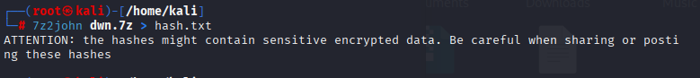
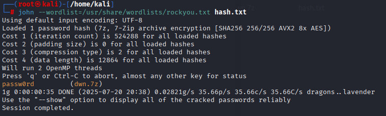
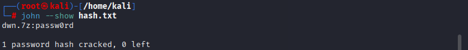

# password-cracking
Este repositório demonstra o processo de extração do hash de um arquivo .7z protegido por senha e a subsequente quebra da senha utilizando ferramentas de segurança ofensiva. O objetivo é puramente educacional, visando ilustrar uma aplicação prática de recuperação de senhas.

* Demonstração de Quebra de Senha de Arquivos 7-Zip

# Visão Geral
O processo envolve duas etapas principais:

* Extração do Hash: Utiliza-se a ferramenta *7z2john* para extrair o hash da senha do arquivo dwn.7z.

* Quebra da Senha: Emprega-se o John the Ripper, uma popular ferramenta de quebra de senhas, para descobrir a senha original a partir do hash extraído, utilizando uma lista de palavras (wordlist).

# Ferramentas Utilizadas
* Kali Linux: O sistema operacional utilizado, que já vem com muitas ferramentas de segurança pré-instaladas.

* 7z2john: Um utilitário do conjunto de ferramentas John the Ripper, projetado especificamente para converter arquivos 7-Zip em um formato de hash que o John possa entender.

* John the Ripper: Uma ferramenta de código aberto para detecção e quebra de senhas.

* RockYou Wordlist: Uma das listas de palavras mais conhecidas, contendo milhões de senhas comumente utilizadas. Localizada em **/usr/share/wordlists/rockyou.txt** na maioria dos sistemas baseados em Debian, como o Kali.

# 📝 Processo Passo a Passo

A seguir, estão os comandos exatos executados no terminal para realizar a demonstração.

## 1. Extração do Hash do Arquivo 7-Zip
O primeiro passo é usar o 7z2john para extrair o hash do arquivo dwn.7z e salvá-lo em um arquivo de texto chamado hash.txt.
```
┌──(root㉿kali)-[/home/kali]
└─# 7z2john dwn.7z > hash.txt
ATTENTION: the hashes might contain sensitive encrypted data. Be careful when sharing or posting these hashes
```


## 2. Quebra da Senha com John the Ripper
Com o hash salvo, utilizamos o **John the Ripper** e a wordlist **rockyou.txt** para iniciar um ataque de dicionário e encontrar a senha.
```
┌──(root㉿kali)-[/home/kali]
└─# john --wordlist=/usr/share/wordlists/rockyou.txt hash.txt
Using default input encoding: UTF-8
Loaded 1 password hash (7z, 7-Zip archive encryption [SHA256 256/256 AVX2 8x AES])
Cost 1 (iteration count) is 524288 for all loaded hashes
Cost 2 (padding size) is 0 for all loaded hashes
Cost 3 (compression type) is 2 for all loaded hashes
Cost 4 (data length) is 12864 for all loaded hashes
Will run 2 OpenMP threads
Press 'q' or Ctrl-C to abort, almost any other key for status
passw0rd     	(dwn.7z)	   
1g 0:00:00:35 DONE (2025-07-20 20:38) 0.02821g/s 35.66p/s 35.66c/s 35.66C/s dragons..lavender
Use the "--show" option to display all of the cracked passwords reliably
Session completed.
```

## 3. Exibição da Senha Encontrada

Após a conclusão do processo, o comando **--show** é usado para exibir a senha que foi quebrada e associada ao hash.
```
┌──(root㉿kali)-[/home/kali]
└─# john --show hash.txt                                	   
dwn.7z:passw0rd

1 password hash cracked, 0 left
```
A senha do arquivo dwn.7z foi descoberta como sendo **passw0rd.**

## Conclusão
Esta demonstração ilustra como ferramentas de segurança podem ser usadas para recuperar senhas de arquivos compactados. Ela ressalta a importância de utilizar senhas fortes e complexas para proteger dados sensíveis, pois senhas comuns podem ser facilmente descobertas por meio de ataques de dicionário. **O processo de descoberta dessa senha **(passw0rd)** durou apenas **10 segundos**.**

## Aviso Legal
As informações e demonstrações contidas neste repositório são destinadas exclusivamente a fins educacionais e de conscientização em segurança. O uso dessas ferramentas para atacar sistemas ou arquivos para os quais você não tem autorização explícita é ilegal e antiético. O autor não se responsabiliza pelo mau uso das informações aqui apresentadas.
